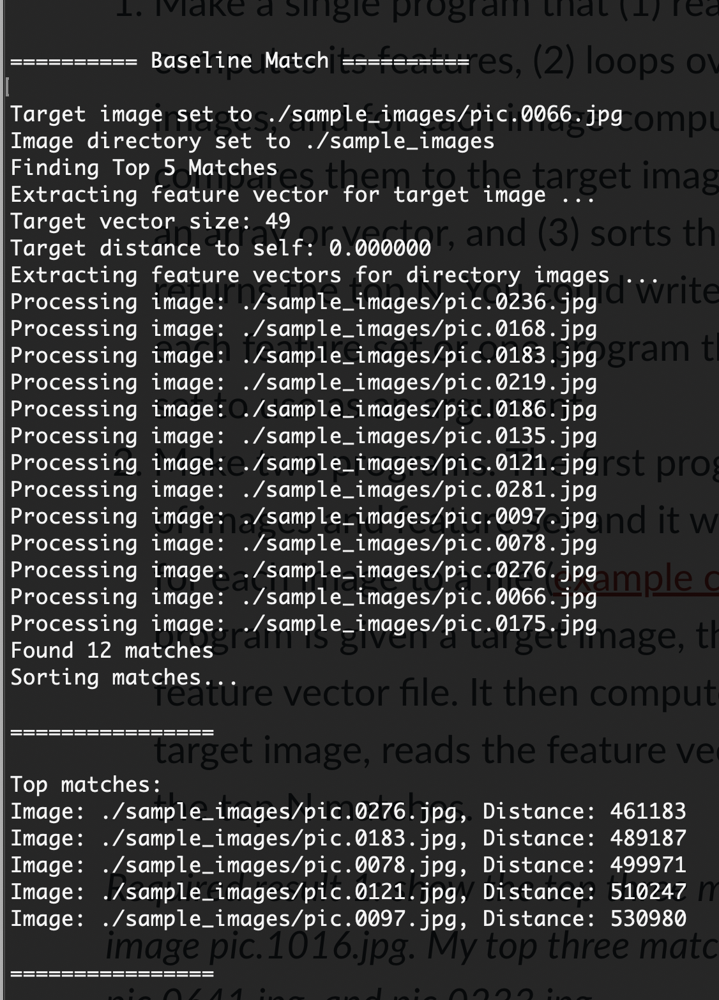
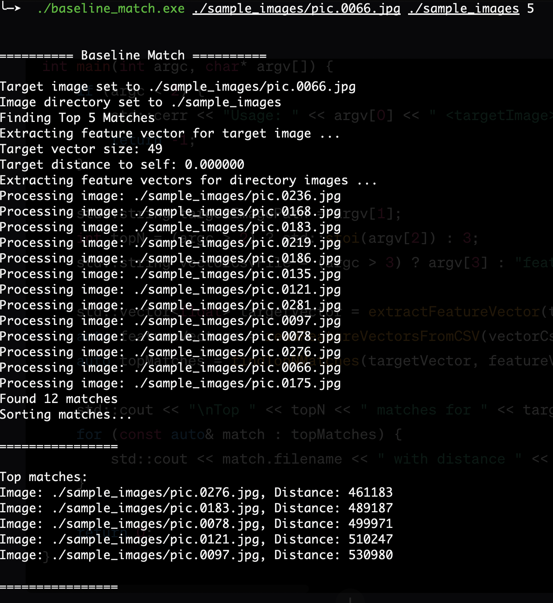
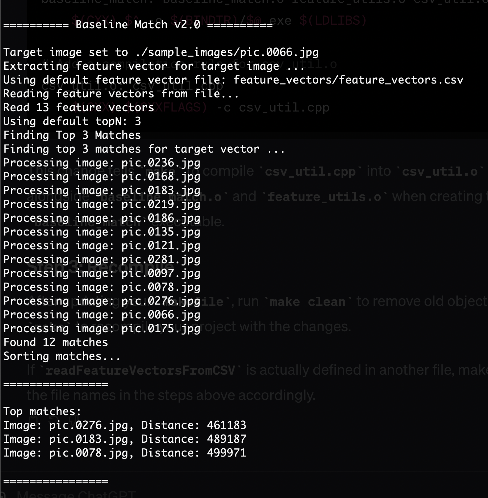

# Project Two

## Tasks

Inputs:
T = target image
B = image database
F = method for computing features
D(Ft, Fi) = distance metric for two images
N = desired number of output images

-   [ ] Baseline Matching
-   [ ] Histogram Matching
-   [ ] Multi-histogram Matching
-   [ ] Texture and Color
-   [ ] Deep Network Embeddings
-   [ ] Compare DNN Embeddings and Classic Features
-   [ ] Custom Design

## How to compile

> Make sure you have opencv installed on your system.

1. To compile a new executable enter the following in the terminal from within the `/src` dir:
   `make <insert name from makefile>` i.e. `make photo` for the photo viewer.

2. Then navigate to the `/bin` directory and run the name of the executable i.e. `./photo.exe`

## Run these programs

1. Navigate to the directory containing the `.exe` files and run them as such:

-   `./photo.exe starry_night.jpg`
    > Relative path to any image file.
-   `./vid.exe`
    > Ensure the `haarcascade_frontalface_alt2.xml` file is in the same directory.

### Baseline Matching

v1.0

This version iterates through the sample_images directory every time it is called to match the
target image vectors to the top N matches within the directory. This is not sustainable long-term
if we will be comparing many images.

v2.0

This version consists of two parts. The first extracts all of the features into a .csv file and the second references the feature vectors within the csv file instead of having to create them
every iteration

### Histogram Matching

Use a single normalized color histogram as the feature vector. Use histogram intersection as the distance metric.
